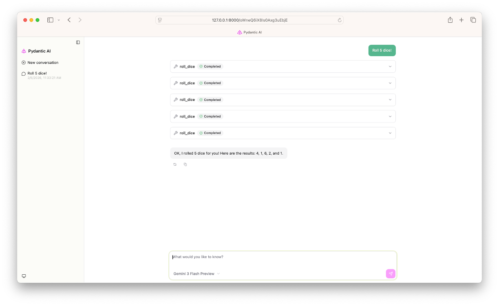

# Agent Template



This repository is a minimal template for building an AI agent using `pydantic-ai`.

## **What this template provides**

- A simple `Agent` configured in `main.py`.
- A small example tool (`roll_dice`) demonstrating how to expose functions to the agent.
- A browser-based chat UI

### **Requirements**

- Python 3.13 or newer
- Provider API credentials (e.g. Google, Anthropic, or OpenAI keys)

## **Create a repository from this template & setup**

Follow these numbered steps to create a new repository from the template (web) and set up locally:

1. On GitHub, open this template repository and click "Use this template" → "Create a new repository". Give the new repo a name and create it under your account or organization.

2. Clone your newly-created repository and change into the project directory (replace the URL with your repo's clone URL):

```bash
git clone https://github.com/{your-name}/{your-repo}.git
cd your-repo
```

3. Make the helper script executable and run it to create a virtual environment, install dependencies, and start the web UI:

```bash
chmod +x run_interface.sh
./run_interface.sh
```

4. Open http://127.0.0.1:8000 in your browser to interact with the agent.

5. Make changes! The chat window will automatically refresh after saving changes to the agent.

## **LLM API Configuration**

- Create a `.env` file in the project root and add the environment variables required by your chosen provider. Examples (replace values with your keys):

```env
# For Google Gemini (example)
GOOGLE_API_KEY=your_google_api_key_here

# For OpenAI (example)
OPENAI_API_KEY=your_openai_api_key_here
```

- `main.py` uses `load_dotenv()` so keys in `.env` will be loaded automatically at runtime. Edit the `Agent(...)` line in [main.py](main.py) to choose a different model or provider.

## **Usage**

- Run the helper script to prepare the environment and launch the interface:

```bash
./run_interface.sh
```

- Open http://127.0.0.1:8000 in your browser to chat with the agent and try the `roll_dice` tool.
